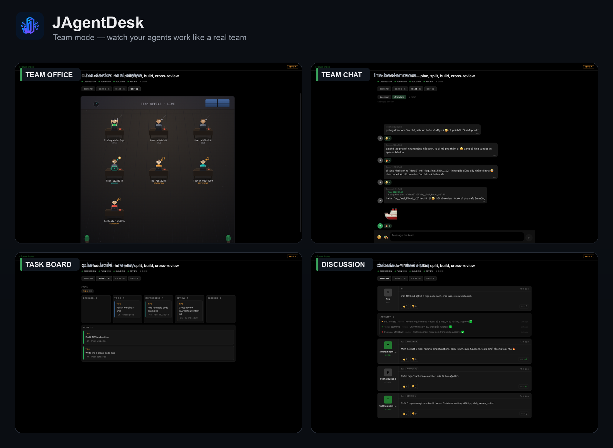

# JAgentDesk

**Self-hosted remote control for your coding agents — now with a built-in Kubernetes cockpit.**

JAgentDesk lets you run AI coding agents (Claude Code, Codex, and more) on your own
machine and drive them from anywhere. A lightweight **daemon** runs on your workstation and
manages agent processes; **desktop** (macOS / Windows / Linux) and **mobile** (iOS / Android)
apps connect straight to it over **Tailscale** — no relay server, no data leaving your
tailnet. Every device completes an application‑level **pairing** (offer link / QR + a 6‑digit
code) before it can control the daemon.

> **📦 [Download the latest release →](https://github.com/knoobdev/jagentdesk/releases/latest)**

## 👀 Team mode — watch your agents work like a real team

Flip on **Team mode** and a single message spins up a whole team: it plans, splits the work
into a live **task board**, builds, cross‑reviews itself (BA / Tester / Pentester), and even
hangs out in a **Telegram‑style team chat** — a shaded little **office** shows every teammate
at their desk, in real time, doing exactly what they're actually doing.

<p align="center">
  
</p>

JAgentDesk is a rebranded, independently‑developed fork of [Paseo](https://github.com/getpaseo/paseo)
with a few deliberate boundaries:

- **No in‑app editor.** You can view files, diffs, and logs — but you edit through the agent, not a text editor.
- **Tailscale is the only remote transport.** No JAgentDesk relay.
- **Application‑level pairing** with an offer link / QR and a 6‑digit verification code.
- **Multi‑agent orchestration** (Supervisor → Lead → Peer) and agent‑to‑agent messaging.

---

## What can it do?

- **Run & steer agents remotely** — start agents, send prompts, watch streamed output and tool
  calls, interrupt runs, review file diffs, all from desktop or phone.
- **Multiple providers** — Claude Code and other CLI agents, each with model / thinking /
  permission controls in the composer.
- **Agent orchestration** — a Supervisor/Lead/Peer runtime; agents can `list_agents`,
  `send_agent_prompt`, and `create_agent` to coordinate work across the daemon.
- **Kubernetes cluster management** — a full Kubernetes cockpit built into the app.
- **Per‑cluster AI chat** — ask an agent about any resource or its logs; the agent uses
  real `kubectl` tools scoped to the exact cluster you connected.
- **Databases** _(new)_ — a full database IDE built into the app: seven engines (PostgreSQL,
  MySQL, SQLite, SQL Server, Oracle, MongoDB, ClickHouse), multiple databases per connection, an
  object explorer with counts, a data grid with inline editing, a SQL console with autocomplete and
  query plans, ER diagram, and an AI chat with SQL tools — credentials never leave the daemon.
- **Forge Hub** _(new)_ — manage **GitHub · GitLab · Bitbucket** (cloud + self‑hosted) from
  afar, like their web apps: connections, a cross‑account repositories browser, server‑side
  Code tree, commits, Pull/Merge requests (review · merge/squash/rebase · auto‑merge),
  Pipelines/CI (job · log · rerun/cancel · artifacts), releases & tags, and issues — driven by
  `gh`/`glab` + Bitbucket REST from the daemon, tokens never leaving it.
- **Forge assistant** _(new)_ — a chat agent inside Forge that operates the forges via `forge_*`
  tools (reads plus pairing‑gated writes: comment, create issue, rerun pipeline, merge/create
  PR); the tools are shared, so any agent can use them, and a mobile chat widget opens it anywhere.
- **Skills** _(new)_ — reusable expertise agents **use** (attach many from the composer) and
  **learn** from real conversations; auto‑loaded by message, no hand‑typed corrections.
- **Plugins** _(new)_ — extend the app with local, trusted code: surfaces, sidebar items,
  workspace panels, command‑center items, attachment sources, and themes (off by default).
- **Active‑turn steering** _(new)_ — send a message into a running turn without cancelling it.
- **Agentic browser** _(new)_ — the agent drives a real built‑in browser (open tabs, click,
  evaluate) with **anti‑detect fingerprint profiles** (coherent per‑OS identity, proxy + WebRTC
  guard, extensions, custom scripts) and a **session vault** for your own logins.
- **Autonomous run** _(new)_ — a toggle in the agent chat that keeps the **same** agent going,
  turn after turn, unattended — it keeps its open browser tab + context, works toward what you
  asked, and **stays alive to react to things that arrive over time** (e.g. new replies) instead
  of stopping after one batch. Not cron/schedule: one agent re‑invoked back‑to‑back, with a
  durable "already‑done" record so it never repeats itself. Off by default; you pick the model
  and mode, safety caps are built in.
- **Session sharing** _(new)_ — hand one agent's chat to someone outside your tailnet through a
  **Cloudflare‑tunnel web link** they open in any browser (no app install). They ask to join, you
  **Accept** on any of your devices, and they enter a **6‑digit code** to chat in that session; you
  see them typing live and can kick or stop anytime. Off by default, scoped to that one agent,
  dangerous actions still ask you. Grant extra capabilities per share — **Files, Changes, Terminal,
  model/mode, read‑only (chat‑only), and an Artifacts canvas** — and manage every live share from a
  dedicated **Shared sessions** page in the menu.
- **Usage & cost insights** _(new)_ — a dashboard of tokens, spend, and per‑model / per‑agent
  breakdowns.
- **Multi‑language UI** _(new)_ — switch the app language from Settings.

---

## ✨ New in this release

### Team mode comes alive (v0.9.36)

- **Team chat — the "chém gió" rooms.** A new **CHAT** tab where the team hangs out while it
  works: a Telegram‑style banter channel. Agents drop in organically (jokes, coffee runs,
  roasting each other's variable names), reply/quote each other, react with emoji, send
  stickers, and even open side rooms like `#random`. You can join too — type, react, sticker.
- **A living virtual office.** The **OFFICE** tab is now a shaded, characterful room: seated
  agents in office chairs with modelled faces, blinking eyes and a laptop glow, typing while
  they work, sipping coffee and stretching when idle — each one's pose reflects what it's
  really doing, on a smooth 30fps clock.
- **App‑wide notifications.** Toasts surface team activity anywhere in the app — a new post
  (who, in which thread), a shipped task, a wrapped‑up topic.
- **A thread that follows along.** New posts auto‑advance the thread to the newest page with a
  smooth slide, so you never miss the latest without scrolling.
- **Branding fix.** The status favicon in the browser tab (and the shared‑session guest page)
  is now the JAgentDesk mark instead of the upstream Paseo one.

### Team mode — one-shot on a new workspace (v0.9.35)

- **Turn on Team mode, send one message, get a team.** Arming the Team-mode toggle on a
  brand-new workspace and sending the first message now spins up the full team instead of a
  lone agent: it creates the real lead agent, then opens a forum topic with that agent as
  origin/lead and dispatches the bootstrap — the lead plans, splits tasks, and brings in
  reviewers. Previously that first message silently ran as a solo turn (the forum never
  opened) because the armed flag was lost in the new-workspace → workspace-tab handoff.
- **The lead's tab shows its title right away** instead of hanging on "loading agent title"
  (a one-shot lead has no first turn to summarize, so it's now titled from the brief).

### Team mode — office, real code review & fixes (v0.9.34)

- **Virtual office** — a new **OFFICE** tab renders the team working in real time: each
  teammate is a little character at a desk whose pose + badge reflect their actual state
  (working / reviewing / waiting on the boss / talking / shipped / idle), so you can _see_
  what the team is doing at a glance.
- **Code review is now first-class in the core** (alibaba/open-code-review methodology): a
  review is structured **findings** (file + line + category + severity + suggestion); the
  **daemon derives the verdict** from severities (any critical/high, or a medium in the
  role's own dimension → changes requested) and a task is done only when **BA, Tester and
  Pentester all approve**. The task detail renders a real code-review panel.
- **Ask the boss** — when only the human can decide, the lead posts the question **into the
  thread** _and_ pops the native **AskUserQuestion** prompt in your chat; recording your
  answer clears the waiting state.
- **Mobile** — the Team screen is now responsive (stacked dashboard, one-column board,
  bottom-sheet task detail, wrapping stats/posts) instead of desktop-only.
- **Fixes** — team-mode peers no longer scatter into duplicate workspaces (workspace is
  reused per directory); creating a workspace no longer spawns **two** agents (createAgent
  is idempotent by message id); the **Team-mode toggle now shows on a new-workspace
  composer**.

### Team mode — Agent Forum (v0.9.33)

- **Turn on Team mode** in the chat composer and send a coding request — instead of one
  agent replying, a **team** opens a topic and works it like real people: discuss and debate
  an approach, agree, split it into tasks/subtasks, spawn peers, build, then review each
  other's work. Built on the existing Supervisor/Lead/Peer orchestration.
- **"Team" screen** in the menu, styled like a classic vBulletin forum:
  - a **dashboard** overview (threads / active / shipped / posts / tasks) with a
    tasks‑by‑status **donut** and a tasks‑by‑epic bar chart;
  - **threads** of vBulletin‑style posts — Markdown (fenced code blocks, inline code,
    quotes, links, images), reply/quote, @mentions, and 👍/👎 **reactions** with a rep
    score; status/review events fold into a separate, paginated **activity** stream;
  - a **Jira‑style board** — all six columns incl. Done, epic filter, and a **task detail**
    (status, epic, assignee, reporter, **hour estimates**, description, comment thread, and
    **re‑open tracking** with reasons);
  - threads + posts + activity are independently **paginated**, with smooth loading.
- **Human tone** — agents discuss in **your language**, with real personality and emoji, and
  vote when a point genuinely lands (never forced).
- **Role‑based review** — when a task hits review, a **BA / Tester / Pentester** inspect the
  change and approve or request changes (open‑code‑review style); verdicts land as task comments.
- **Human in the loop** — when only you can decide, the lead asks via the native
  **AskUserQuestion** prompt in your chat and records your answer back in the thread.
- **You're in control** — delete/manage old topics from the index.
- Opt-in per session (cost-aware); combine with the Autonomous (∞) toggle for continuous
  drive. See [CHANGELOG.md](CHANGELOG.md) for details.

### Session sharing v2 — real‑app guest surface (v0.9.32)

The guest no longer sees a bespoke mini‑page: they join the **real app**, scoped to one agent by the
daemon (ADR‑0019). Everything the host grants renders with the same components the host uses.

- **Grant capabilities per share** — beyond chat, toggle **Files, Changes, Terminal, model/mode,
  read‑only (chat‑only, no composer), and an Artifacts canvas** (live‑renders the HTML/SVG/Mermaid/
  code the agent produces). Each defaults **off**; the daemon enforces every grant on the wire —
  the hidden control is never the guard — and confines file/terminal access to the agent's workspace.
- **Guests can't fork or re‑share** — host‑only actions (fork the agent, the Share button) are hidden
  on the guest surface and denied by the guest scope even if reached.
- **Dedicated Shared sessions page** — manage every live share across hosts from the **main menu**
  (not buried in Settings), with each guest's device and a live **typing…** indicator per agent.
- **Sturdier connection** — guests survive **idle, screen‑lock, network changes, and F5** and
  auto‑reconnect (the token persists; remote guests are exempt from the local‑retry cap). The pairing
  code shows a **live expiry countdown** with refresh.
- **Fixes** — model/mode changes no longer fail with `access_denied`; the Artifacts tab no longer
  crashes the app on a non‑empty timeline.

Still off by default (toggle in **Settings → Host**, restart to apply); needs `cloudflared` on the
host. See [CHANGELOG.md](CHANGELOG.md) for full notes.

### Autonomous run (v0.9.13)

- **Keep the agent going, unattended** — a new **∞ toggle** in the chat composer turns on
  _autonomous mode_ for the agent you're already talking to. The daemon re‑invokes that **same
  agent/session** turn after turn (keeping its open browser tab + context) so it keeps working
  toward what you asked — until it reports the goal is done, or you turn it off.
- **Runs for hours, reacts over time** — "nothing to do right now" (e.g. waiting for replies)
  no longer stops it: it stays alive, re‑checks on a growing backoff, and acts when something
  new appears. This is what lets it operate continuously, not finish in one batch.
- **Never repeats itself** — a compact, durable _done_ record is fed back every turn (survives
  context compaction + daemon restart), so the agent skips work it already did.
- **You stay in control** — off by default (`daemon.autorun.enabled`, toggle in Settings); you
  pick the model and mode in the composer — autonomous never changes them; hidden safety caps
  bound cost/time. Not cron/schedule.

### Forge Hub readability + fixes (v0.9.12)

- **Pipeline logs**: real ANSI colours, a line-number gutter, a Refresh button, and clean copy
  (no more raw `\x1b[0;m` escape codes / `section_*` markers).
- **Code viewer**: line-number gutter + syntax highlighting, slightly larger font.
- **Pull requests**: real conflict detection (banner + list chip, merge disabled on conflict) and
  up-front Commits / Files-changed counts.
- **Author** shown on Pipelines (who triggered) and Releases (who published).
- **Resizable assistant**: the desktop Forge assistant is a first-class right dock — open by
  default, drag to resize, collapse to hide.
- **Fix**: New workspace no longer occasionally creates two agents; mobile switch-repo shows a
  loading skeleton.

See [CHANGELOG.md](CHANGELOG.md) for full v0.9.12 notes.

### Forge Hub — repo Members + mobile navigation (v0.9.11)

- **Members** — manage repo access from a new per-repo section: list members (avatar · name ·
  role), **invite** by username with a role (Read/Triage/Write/Maintainer/Admin), or remove —
  across GitHub & GitLab. New `forge.member.*` RPCs.
- **Mobile section tabs** — a scrollable tab strip (Overview · Code · Commits · Pull requests ·
  Pipelines · Releases · Issues · Members) now shows on every repo screen, so switching sections
  no longer requires backing out to the menu.
- **Clearer "Switch repo" loading** — a repo-shaped skeleton while repositories load (desktop + mobile).

See [CHANGELOG.md](CHANGELOG.md) for full v0.9.11 notes.

### Forge Hub polish — Issue detail + mobile fixes (v0.9.10)

- **Issue detail** — issues now show their full body and comment thread (markdown), not just
  the title; the list shows number, age, author, labels and comment count. New `forge.issue.get` RPC.
- **Mobile layout fixes** — Pipelines (legible title, stage→job graph, in‑app log viewer, clean
  toolbar), Pull request tabs (early counts + horizontal scroll), Commits (wrapping titles),
  Connections (no overflow, slim "N connected · Manage" footer), and list loading skeletons.
- **Forge assistant repo scope** — switching repos then opening the chat now targets the new
  repo with a fresh context instead of the previously selected one.

See [CHANGELOG.md](CHANGELOG.md) for full v0.9.10 notes.

### Forge Hub + Forge assistant + mobile (v0.9.9)

- **Forge Hub** — remote GitHub / GitLab / Bitbucket management (connections, repos, code
  tree, commits, PR/MR review & merge, CI pipelines, releases, issues) driven from the daemon.
- **Forge assistant** — a chat agent that operates the forges via `forge_*` tools (reads +
  pairing‑gated writes), usable from the Forge panel on desktop and a floating chat widget on mobile.
- **Forge on mobile** — compact master‑detail so repo Code/Commits render, light‑theme colour
  fixes (no more black boxes), status‑bar‑safe toolbar, and stacked repo/commit rows for phones.
- **Paseo 0.8.0 selective port** — Gajae Code provider, Android Studio editor target, `workspace
rename` CLI (rebranded, additive).

See [CHANGELOG.md](CHANGELOG.md) for full v0.9.9 notes.

### Usage-cost clarity + browser fixes (v0.2.2)

- **Prompt-cache savings in Usage & Cost** — see how much prompt caching saved (aggregate
  - per-model + per-agent, estimated). The headline cost stays provider-reported; JAgentDesk
    surfaces the caching benefit rather than overriding the CLIs' own auto-tuned caching.
- **Fixes:** agent-loaded extensions now inject (open tabs reload after loading); the TOKENS
  total no longer counts cache re-reads (so it isn't wildly inflated next to the context window);
  the fingerprint-profile detail box no longer overflows.

See [CHANGELOG.md](CHANGELOG.md) for full v0.2.2 notes.

### Agentic browser — self-authored extensions, more tools & fixes (v0.2.1)

- **Agents can author & run their own Chromium extensions** — `browser_scaffold_extension`
  writes a working MV3 skeleton, `browser_load_extension` loads it, and `browser_cdp` runs
  raw Chrome DevTools Protocol (inject before page load to bypass CSP, intercept requests,
  drive any DevTools domain) — for event-driven page automation instead of cron polling.
- **Fuller fingerprint‑profile control** — `browser_profile_update` / `browser_profile_delete`
  tools, and the Settings card now shows each profile's fingerprint, lets you set a **proxy**
  (server + auth), toggle spoofing, and cycle the WebRTC policy.
- **Browser tools are ON by default.**
- **Fixes:** editing a fingerprint profile no longer silently disables browser tools; the
  profiles card layout is fixed; default starter skills are gone; the database grid clears its
  selection on tap‑outside on mobile too; and mobile Tailscale no longer sticks on
  "reconnecting" after the screen was off.

See [CHANGELOG.md](CHANGELOG.md) for the full v0.2.1 notes.

### Agentic browser — fingerprint profiles & full customisation (v0.2.0)

The agentic browser gains a coherent anti‑detect **profile system** so the agent (or you) can
give the built‑in browser a consistent device identity for legitimate automation of **your own**
accounts:

- **Coherent fingerprint profiles** — one identity per profile (User‑Agent + UA Client Hints,
  WebGL vendor/renderer, timezone, locale, screen, hardware, seeded canvas/audio noise), generated
  from real‑device templates so signals never contradict each other. Spoofing applies at the engine
  boundary (CDP `Network.setUserAgentOverride` / `Emulation.setTimezoneOverride`) plus a before‑page
  init script that masks itself as native code.
- **Proxy & WebRTC** — attach a per‑profile proxy (the only real way to change the observed IP) with
  a WebRTC leak guard (`force‑proxy` / `disable`) so the real IP isn’t exposed over STUN.
- **Extensions & custom scripts** — load your own unpacked Chromium extensions and inject custom
  init scripts, so the agent can fully customise the browser (automation, macros).
- **Profiles UI + agent tools** — manage profiles under **Settings → Host** (list / create per‑OS /
  select / delete, or “Real identity”); the agent can `browser_profile_list` / `browser_profile_create`
  / `browser_profile_use` to create or reuse a profile mid‑conversation.

Also in this release: **database grid selection** now persists across pages and clears when you
click outside the table, and the **Usage & Cost** token totals render at full precision (no more
collapsing every large number to “1m”).

See [CHANGELOG.md](CHANGELOG.md) for the full v0.2.0 notes.

### Upstream Paseo v0.7.2 merge (v0.0.5)

JAgentDesk now tracks Paseo **v0.7.2**, folding in its agent, file, and forge improvements while
keeping every JAgentDesk feature (DB IDE, Kubernetes, Skills, no in‑app editor, Tailscale‑only):

- **Provider options & tool policy** — pass provider‑native JSON settings per agent and pre‑approve
  specific tools, validated by the daemon.
- **File‑system operations** — create, rename, duplicate, and delete files straight from the explorer.
- **Forge CI checks** — GitHub / GitLab / Gitea pull‑request check status, with a dedicated
  pull‑request panel and a changes panel.
- **Plugins from git sources** — install and update plugins directly from a git repo, not just a
  local folder.
- **Workspace labels**, **live daemon‑config reload**, agent **timeline rewind**, and a **reconnect
  toast** for flaky networks.

See the [v0.0.5 release notes](https://github.com/knoobdev/jagentdesk/releases/tag/v0.0.5) for the
full merge changelog.

### Databases — a full database IDE (desktop **and** mobile)

Open **Databases** from the sidebar to work with your data from inside JAgentDesk:

- **Seven engines** — PostgreSQL, MySQL, SQLite, SQL Server, Oracle, MongoDB, ClickHouse — behind
  one provider‑agnostic contract; credentials never leave the daemon.
- **Multiple databases per connection** — list and switch databases on a server, with a
  an IDE‑style tree (schemas, tables, columns, indexes, foreign keys, views, sequences, routines)
  showing per‑node counts, plus **cross‑database compare** (structure + data).
- **Data grid** — inline editing, `WHERE` filter, column sort, two‑axis scroll, clone row, CSV
  import, export to CSV/JSON/SQL, aggregate view, record view, and transaction isolation levels.
- **SQL console** — schema‑aware autocomplete, inspections, multiple result tabs, `EXPLAIN` / query
  plan, and query history — with **foreign‑key navigation** and **full‑text search**.
- **ER diagram**, **DDL view**, **schema diff**, and an **AI chat** with SQL tools grounded on the
  live schema.

See [CHANGELOG.md](CHANGELOG.md) for the full v0.0.4 notes.

### Kubernetes cluster management (desktop **and** mobile)

Open **Clusters** from the sidebar to manage Kubernetes from inside JAgentDesk:

- **Connect any context** from `~/.kube/config` (docker‑desktop, GKE, EKS, …) — browsing needs
  no project; just connect and explore.
- **Browse every resource type** — Namespaces, Nodes, Events, Pods, Deployments, DaemonSets,
  StatefulSets, ReplicaSets, Jobs, CronJobs, ConfigMaps, Secrets, Services, Ingress, and more,
  with a searchable, sortable, responsive table (compact columns on phones).
- **Cluster Overview dashboard** — the kind menu opens on a KPI dashboard (Nodes, Pods,
  Deployments, Services, Namespaces, restarts), a pod‑health bar, and a node‑readiness list.
- **Rich resource detail** — a structured resource overview plus raw **YAML**, live **logs**
  (follow + container selector, **timestamps** toggle, severity colouring, **download**), an
  interactive **shell** (exec), **port‑forward** (Pods **and** Services), and **Events** filtered
  to the resource. ConfigMap / Secret values render as scrollable code blocks, with secrets masked
  behind a per‑key **Show / Hide**.
- **Actions** — Scale, Restart, Rollback (Deployments), Edit YAML / Apply, and Delete — with the
  correct Kubernetes patch strategies under the hood.
- Works identically on the **Electron desktop app** and the **iOS/Android app**.

### Ask AI about your cluster

- An **Ask AI** button on every resource hands the agent the exact resource — and, when the logs
  pane is open, the on‑screen log buffer — so _“what’s wrong in this log?”_ just works.
- The agent is wired to **cluster‑scoped `kubectl` tools** (`kubectl_get` for get/describe/logs/list,
  `kubectl_apply` for changes) that target the exact cluster you connected, even if it isn’t in a
  local kubeconfig.
- Replies stream live (assistant text **and** tool calls) in a chat dock that sits beside the
  resource view — a right‑hand side panel on desktop, a floating chat button on phones.

### Cluster chat history, new chats & project picker

- **History** — every conversation for a cluster, with titles and timestamps; tap to switch back
  to any past chat and its full transcript.
- **New chat** — start a fresh conversation; empty chats get distinct titles (no more duplicate
  “Untitled chat”).
- **Project picker** — choose which project/workspace a cluster chat runs in (the agent’s working
  directory), instead of it silently picking one for you. The picker appears when you have more
  than one project.

For a full walkthrough see **[docs/kubernetes.md](docs/kubernetes.md)**.

### Skills — reusable expertise your agents use and learn

Open **Skills** from the sidebar to build reusable expertise that **agents use** (many at once)
and **learn** from real conversations — not throwaway one‑off agents:

- **Create / edit / delete** a skill with an icon, name, description, an instruction prompt, and
  comma‑separated tags.
- **Attach from the composer** — a **Skills** picker in the composer lets you attach **one or more**
  skills to the current agent; their instructions are injected so the agent actually uses them.
  **Auto‑load** (on by default) matches relevant skills to your message automatically.
- **Learn from the conversation** — no hand‑typed corrections. 👍 a real assistant reply and the
  skill captures that answer as knowledge (+XP); the agent can also **propose a lesson** after a
  turn for you to approve or reject.
- **Level up** — skills earn XP as they learn, running Novice → Expert with an XP bar and a
  **graduation checklist**.
- Available on **desktop and mobile**.

### Plugins — extend the app with local, trusted code

Install local plugins that contribute surfaces, sidebar items, workspace panels, command‑center
items, attachment sources, and themes:

- **Local‑disk only** — `jagentdesk plugin install <dir>`; no marketplace, no network install.
- **Compiled + run on the daemon** — an esbuild pipeline splits client/server code; each plugin
  runs in its own subprocess and reaches the daemon over an internal session.
- **Trusted, off by default** — plugins run unsandboxed with a full daemon session, so
  `pluginsEnabled` defaults to **false**; a reserved `plugin:<id>` identity keeps a tailnet node
  from ever impersonating a plugin. Manage them under **Settings → Plugins** (list / install /
  enable / disable / remove / logs).

### Active‑turn steering

Send a message **into a running turn** without cancelling it. **Settings → Default send** offers
**Steer** (inject into the live turn, falling back to interrupt), **Interrupt**, or **Queue**.

### Agentic browser (desktop)

The agent drives a real Chromium `<webview>` over CDP — no external Playwright to wire up:

- **Cockpit UI** matching the design mock: a live step timeline of `browser_*` actions, an
  “agent driving” badge, and element highlights when the agent clicks.
- **Stealth** _(opt‑in)_ normalises the classic automation tells (`navigator.webdriver`,
  languages/plugins, WebGL vendor, hardware) before any page script runs — for legitimate
  automation of **your own** accounts.
- **Fingerprint profiles** _(v0.2.0)_ upgrade stealth to a full, coherent identity system —
  canvas/audio/WebGL/UA‑CH/timezone/screen spoofing from real‑device templates, per‑profile proxy +
  WebRTC leak guard, custom extensions and init scripts, managed in the UI or via agent tools. See
  the release notes above.
- **Session vault** _(opt‑in)_ captures/restores a domain’s logged‑in cookies, encrypted at rest
  with the OS keychain (`safeStorage`).

### Usage & cost insights

Open **Usage & Cost** for a dashboard of token usage and spend — totals plus per‑model and
per‑agent breakdowns. Empty accounts show the full layout with zeroed metrics rather than a blank
“no data” page.

### Multi‑language UI

The app UI can be switched between languages from **Settings**; strings are fully externalised so
new locales drop in without code changes.

### More polish

- **Mermaid diagrams in chat** — fenced ` ```mermaid ` blocks render as live diagrams inline.
- **Pure‑black theme** — an OLED‑friendly true‑black dark theme in **Settings → Appearance**.
- **MiniMax Code provider** — added to the agent provider catalog (icon + model controls).
- **Nix syntax highlighting** — `.nix` files and fenced Nix code now highlight correctly.
- **Distinct titles everywhere** — new agents, orchestration workspaces, and cluster chats get a
  numeric suffix instead of colliding on the same name.

---

## Quick start

Requires **Node.js 22.20.0** and npm. The repo ships a `.tool-versions` file (use
[mise](https://mise.jdx.dev/) to install the exact toolchain). Local Android builds need the
Android SDK; local iOS builds need Xcode.

```bash
git clone https://github.com/knoobdev/jagentdesk.git
cd jagentdesk
npm install
```

Run the daemon, the mobile/web client, and the desktop app in separate terminals:

```bash
npm run dev:server    # the daemon
npm run dev:app       # Expo client (iOS / Android / web)
npm run dev:desktop   # Electron desktop app
```

Or just grab a prebuilt app from the **[latest release](https://github.com/knoobdev/jagentdesk/releases/latest)**
(macOS Apple Silicon / Intel, Windows x64, Linux x64, Android APK, iOS IPA).

> **macOS:** on Apple Silicon, download the **macOS‑Apple‑Silicon** asset. Do not install the
> Intel x64 asset on Apple Silicon — it runs under Rosetta and is intentionally rejected by the app.

---

## Using the Kubernetes features

1. **Connect a cluster.** Sidebar → **Clusters** → pick a context → **Connect** (green dot = connected).
2. **Browse.** Press **Open workloads**. On desktop you get a three‑column layout (kind nav ·
   resource list · chat dock); on phones the kind menu slides in — tap a kind (e.g. **Pod**).
3. **Inspect a resource.** Tap a row for the detail view: overview, YAML, Logs, Shell,
   Port‑forward, Events, and actions.
4. **Ask AI.** Tap **Ask AI** (or the chat button / side panel) — the agent receives the resource
   (and open logs) as context and answers with live `kubectl` output. First set up a provider
   (**Setup providers**) and add at least one project so the chat has a working directory.
5. **Switch / start chats.** Open the **history** (clock icon) in the chat header to see past
   conversations, start a **New chat**, or pick the **project** new chats run in.

---

## Repository layout

- `packages/server` — the daemon: agent lifecycle, WebSocket API, Kubernetes client, and the
  Tailscale bridge.
- `packages/app` — the Expo client for iOS, Android, and web.
- `packages/desktop` — the Electron app for macOS, Windows, and Linux.
- `packages/client` & `packages/protocol` — the shared client and the wire‑protocol contract.
- `packages/cli` — a CLI to control the daemon (`jagentdesk daemon start|stop|restart|status`).
- `docs/` — architecture, data model, development, and feature guides (including
  [Kubernetes](docs/kubernetes.md)).

See [docs/architecture.md](docs/architecture.md) and [docs/development.md](docs/development.md) to
go deeper.

---

## Building releases

`.github/workflows/release.yml` runs on every semver tag push (`v*.*.*`) and on manual dispatch.
It builds the desktop apps (macOS / Windows / Linux), an Android APK, and an unsigned iOS IPA,
then attaches them to the matching GitHub Release. To cut a release:

```bash
# bump every package.json to the target version first, then:
git tag v0.0.1
git push origin main --tags
```

---

## Contributing

Contributions are welcome — please read [CONTRIBUTING.md](CONTRIBUTING.md) first.

**Contributors**

- **[knoobdev](https://github.com/knoobdev)** — maintainer.
- **Claude** (Anthropic) — feature development & engineering.
- **DeepSeek** — engineering support.

---

## Acknowledgements

Huge thanks to **[Paseo](https://github.com/getpaseo/paseo)** and its contributors — JAgentDesk is
forked from Paseo, and that foundation is what let this project get off the ground so quickly.

## License

JAgentDesk is released under **AGPL‑3.0‑or‑later**. See [LICENSE](LICENSE).
