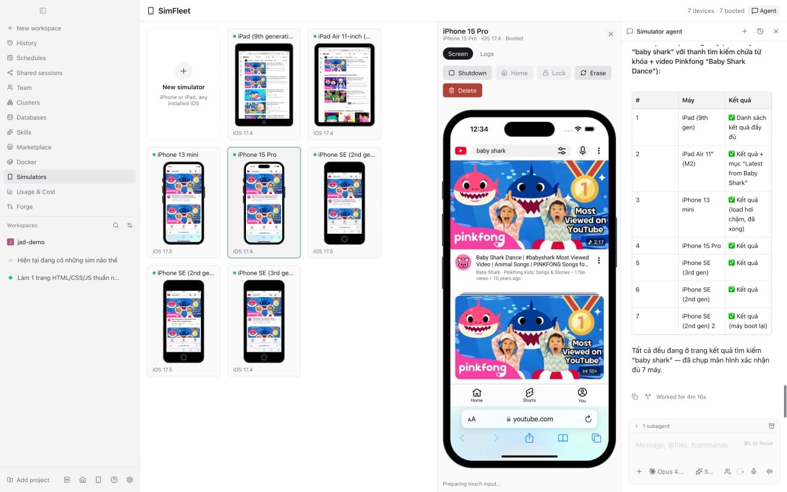

# JAgentDesk

**Self-hosted remote control for your coding agents — now with a built-in Kubernetes cockpit.**

JAgentDesk lets you run AI coding agents (Claude Code, Codex, and more) on your own
machine and drive them from anywhere. A lightweight **daemon** runs on your workstation and
manages agent processes; **desktop** (macOS / Windows / Linux) and **mobile** (iOS / Android)
apps connect straight to it over **Tailscale** — no relay server, no data leaving your
tailnet. Every device completes an application‑level **pairing** (offer link / QR + a 6‑digit
code) before it can control the daemon.

> **📦 [Download the latest release →](https://github.com/knoobdev/jagentdesk/releases/latest)**

## 👀 Team mode — watch your agents work like a real team

Flip on **Team mode** and a single message spins up a whole team: it plans, splits the work
into a live **task board**, builds, cross‑reviews itself (BA / Tester / Pentester), and even
hangs out in a **Telegram‑style team chat** — a shaded little **office** shows every teammate
at their desk, in real time, doing exactly what they're actually doing.

**▶️ Watch the live demo** — a real team building a small app end‑to‑end (real agents, real chat, real reviews). Click the preview for the full 2‑minute video with audio:

<p align="center">
  <a href="docs/media/team-mode-demo.mp4">
    
  </a>
</p>

> ▶️ [**Watch / download the full 2‑minute MP4 (with audio) →**](docs/media/team-mode-demo.mp4)

<p align="center">
  
</p>

JAgentDesk is a rebranded, independently‑developed fork of [Paseo](https://github.com/getpaseo/paseo)
with a few deliberate boundaries:

- **No in‑app editor.** You can view files, diffs, and logs — but you edit through the agent, not a text editor.
- **Tailscale is the only remote transport.** No JAgentDesk relay.
- **Application‑level pairing** with an offer link / QR and a 6‑digit verification code.
- **Multi‑agent orchestration** (Supervisor → Lead → Peer) and agent‑to‑agent messaging.

---

## What can it do?

- **Run & steer agents remotely** — start agents, send prompts, watch streamed output and tool
  calls, interrupt runs, review file diffs, all from desktop or phone.
- **Multiple providers** — Claude Code and other CLI agents, each with model / thinking /
  permission controls in the composer.
- **Agent orchestration** — a Supervisor/Lead/Peer runtime; agents can `list_agents`,
  `send_agent_prompt`, and `create_agent` to coordinate work across the daemon.
- **Kubernetes cluster management** — a full Kubernetes cockpit built into the app.
- **Per‑cluster AI chat** — ask an agent about any resource or its logs; the agent uses
  real `kubectl` tools scoped to the exact cluster you connected.
- **Databases** _(new)_ — a full database IDE built into the app: seven engines (PostgreSQL,
  MySQL, SQLite, SQL Server, Oracle, MongoDB, ClickHouse), multiple databases per connection, an
  object explorer with counts, a data grid with inline editing, a SQL console with autocomplete and
  query plans, ER diagram, and an AI chat with SQL tools — credentials never leave the daemon.
- **Forge Hub** _(new)_ — manage **GitHub · GitLab · Bitbucket** (cloud + self‑hosted) from
  afar, like their web apps: connections, a cross‑account repositories browser, server‑side
  Code tree, commits, Pull/Merge requests (review · merge/squash/rebase · auto‑merge),
  Pipelines/CI (job · log · rerun/cancel · artifacts), releases & tags, and issues — driven by
  `gh`/`glab` + Bitbucket REST from the daemon, tokens never leaving it.
- **Forge assistant** _(new)_ — a chat agent inside Forge that operates the forges via `forge_*`
  tools (reads plus pairing‑gated writes: comment, create issue, rerun pipeline, merge/create
  PR); the tools are shared, so any agent can use them, and a mobile chat widget opens it anywhere.
- **Skills** _(new)_ — reusable expertise agents **use** (attach many from the composer) and
  **learn** from real conversations; auto‑loaded by message, no hand‑typed corrections.
- **Plugins & Marketplace** _(new)_ — extend the app with surfaces, sidebar items, workspace
  panels, command‑center items, attachment sources, and themes. Browse the community catalog at
  **paseo.cafe** from inside the app and install **any Paseo plugin** in one tap — it is
  auto‑rebranded on install so it runs on JAgentDesk (off by default).
- **Find in chat & terminal** _(new)_ — Cmd/Ctrl+F searches the whole chat timeline (highlight +
  next/previous with a whole‑chat match count) and the terminal scrollback.
- **Active‑turn steering** _(new)_ — send a message into a running turn without cancelling it.
- **Agentic browser** _(new)_ — the agent drives a real built‑in browser (open tabs, click,
  evaluate) with **anti‑detect fingerprint profiles** (coherent per‑OS identity, proxy + WebRTC
  guard, extensions, custom scripts) and a **session vault** for your own logins.
- **Autonomous run** _(new)_ — a toggle in the agent chat that keeps the **same** agent going,
  turn after turn, unattended — it keeps its open browser tab + context, works toward what you
  asked, and **stays alive to react to things that arrive over time** (e.g. new replies) instead
  of stopping after one batch. Not cron/schedule: one agent re‑invoked back‑to‑back, with a
  durable "already‑done" record so it never repeats itself. Off by default; you pick the model
  and mode, safety caps are built in.
- **Session sharing** _(new)_ — hand one agent's chat to someone outside your tailnet through a
  **Cloudflare‑tunnel web link** they open in any browser (no app install). They ask to join, you
  **Accept** on any of your devices, and they enter a **6‑digit code** to chat in that session; you
  see them typing live and can kick or stop anytime. Off by default, scoped to that one agent,
  dangerous actions still ask you. Grant extra capabilities per share — **Files, Changes, Terminal,
  model/mode, read‑only (chat‑only), and an Artifacts canvas** — and manage every live share from a
  dedicated **Shared sessions** page in the menu.
- **Usage & cost insights** _(new)_ — a dashboard of tokens, spend, and per‑model / per‑agent
  breakdowns.
- **Multi‑language UI** _(new)_ — switch the app language from Settings.

---

## ✨ New in this release

### SimFleet — agents drive a fleet of iOS simulators (v0.9.40)

<p align="center">
  
</p>

- **One screen for every iOS simulator on the host.** Live device mockups built from Apple's
  real dimensions (Touch‑ID phones and iPads with their home button, Face‑ID devices with
  their true corner radius), headless boot, and a resizable detail panel with a live,
  tappable **Screen** and a streaming **Logs** tab.
- **Chat with an agent that drives them.** A **Simulator agent** dock sits right on the
  screen: ask it in plain words and it boots, taps, types, opens apps and URLs across the
  whole fleet through the `sim_*` tools. In the demo above one message had it boot the
  stopped devices and search YouTube for “baby shark” on all seven.
- **Add simulators from the app or from chat.** Pick any device type × installed iOS runtime,
  choose a quantity, create and boot, or let the agent do it (`sim_create`).
- **Works on phones too.** The detail view slides in from the right and “New simulator” is a
  scrollable bottom sheet.
- **Fixes:** the live view no longer drops the connection (`Transport closed (code 1006)`)
  because frames stream as right‑sized JPEG instead of multi‑MB PNG. Quitting Simulator.app
  no longer shuts down the simulators SimFleet runs. Plugins calling `addSettingsScreen` now
  install.

### Docker for the team, DB registration & a live architecture diagram (v0.9.39)

- **Docker, end to end.** Team agents stand up and manage their own containers with `docker_*`
  tools (run / exec / build / logs / inspect / stop / rm, through the normal tool‑approval flow),
  and you watch and control them from a **realtime cockpit** — live `docker events` (no polling),
  Compose‑project grouping, and a container detail view with **Logs** (find/follow), **Stats**,
  **Inspect**, a `docker cp` **Files** manager, and a **real interactive Exec terminal**.
- **Agents register the databases they work on** — the new `sql_connect` tool opens a connection
  (Postgres / MySQL / SQLite / … via fields, a DSN, or a file) so a database the team provisions
  shows up in your **Databases** panel to watch live.
- **A living architecture diagram** — the team publishes what it's designing to a new **ARCH** tab
  (versioned Mermaid, one pill per revision) so you can step back through how the design evolved.
- **In‑app code editing is back** — workspace files open in a CodeMirror 6 editor with autosave,
  alongside the existing file/diff viewers.
- **Realtime browsing, not polling** — the browser agent now engineers event‑driven capture (page
  hooks / CDP interception) for live‑monitoring tasks instead of re‑snapshotting on a loop.
- **Fix:** plugins that call `defineSettings` now load and enable (the SDK exports it again).

### Older releases

See **[CHANGELOG.md](CHANGELOG.md)** and the [releases page](https://github.com/knoobdev/jagentdesk/releases)
for v0.9.38 and earlier.

### Databases — a full database IDE (desktop **and** mobile)

Open **Databases** from the sidebar to work with your data from inside JAgentDesk:

- **Seven engines** — PostgreSQL, MySQL, SQLite, SQL Server, Oracle, MongoDB, ClickHouse — behind
  one provider‑agnostic contract; credentials never leave the daemon.
- **Multiple databases per connection** — list and switch databases on a server, with a
  an IDE‑style tree (schemas, tables, columns, indexes, foreign keys, views, sequences, routines)
  showing per‑node counts, plus **cross‑database compare** (structure + data).
- **Data grid** — inline editing, `WHERE` filter, column sort, two‑axis scroll, clone row, CSV
  import, export to CSV/JSON/SQL, aggregate view, record view, and transaction isolation levels.
- **SQL console** — schema‑aware autocomplete, inspections, multiple result tabs, `EXPLAIN` / query
  plan, and query history — with **foreign‑key navigation** and **full‑text search**.
- **ER diagram**, **DDL view**, **schema diff**, and an **AI chat** with SQL tools grounded on the
  live schema.

See [CHANGELOG.md](CHANGELOG.md) for the full v0.0.4 notes.

### Kubernetes cluster management (desktop **and** mobile)

Open **Clusters** from the sidebar to manage Kubernetes from inside JAgentDesk:

- **Connect any context** from `~/.kube/config` (docker‑desktop, GKE, EKS, …) — browsing needs
  no project; just connect and explore.
- **Browse every resource type** — Namespaces, Nodes, Events, Pods, Deployments, DaemonSets,
  StatefulSets, ReplicaSets, Jobs, CronJobs, ConfigMaps, Secrets, Services, Ingress, and more,
  with a searchable, sortable, responsive table (compact columns on phones).
- **Cluster Overview dashboard** — the kind menu opens on a KPI dashboard (Nodes, Pods,
  Deployments, Services, Namespaces, restarts), a pod‑health bar, and a node‑readiness list.
- **Rich resource detail** — a structured resource overview plus raw **YAML**, live **logs**
  (follow + container selector, **timestamps** toggle, severity colouring, **download**), an
  interactive **shell** (exec), **port‑forward** (Pods **and** Services), and **Events** filtered
  to the resource. ConfigMap / Secret values render as scrollable code blocks, with secrets masked
  behind a per‑key **Show / Hide**.
- **Actions** — Scale, Restart, Rollback (Deployments), Edit YAML / Apply, and Delete — with the
  correct Kubernetes patch strategies under the hood.
- Works identically on the **Electron desktop app** and the **iOS/Android app**.

### Ask AI about your cluster

- An **Ask AI** button on every resource hands the agent the exact resource — and, when the logs
  pane is open, the on‑screen log buffer — so _“what’s wrong in this log?”_ just works.
- The agent is wired to **cluster‑scoped `kubectl` tools** (`kubectl_get` for get/describe/logs/list,
  `kubectl_apply` for changes) that target the exact cluster you connected, even if it isn’t in a
  local kubeconfig.
- Replies stream live (assistant text **and** tool calls) in a chat dock that sits beside the
  resource view — a right‑hand side panel on desktop, a floating chat button on phones.

### Cluster chat history, new chats & project picker

- **History** — every conversation for a cluster, with titles and timestamps; tap to switch back
  to any past chat and its full transcript.
- **New chat** — start a fresh conversation; empty chats get distinct titles (no more duplicate
  “Untitled chat”).
- **Project picker** — choose which project/workspace a cluster chat runs in (the agent’s working
  directory), instead of it silently picking one for you. The picker appears when you have more
  than one project.

For a full walkthrough see **[docs/kubernetes.md](docs/kubernetes.md)**.

### Skills — reusable expertise your agents use and learn

Open **Skills** from the sidebar to build reusable expertise that **agents use** (many at once)
and **learn** from real conversations — not throwaway one‑off agents:

- **Create / edit / delete** a skill with an icon, name, description, an instruction prompt, and
  comma‑separated tags.
- **Attach from the composer** — a **Skills** picker in the composer lets you attach **one or more**
  skills to the current agent; their instructions are injected so the agent actually uses them.
  **Auto‑load** (on by default) matches relevant skills to your message automatically.
- **Learn from the conversation** — no hand‑typed corrections. 👍 a real assistant reply and the
  skill captures that answer as knowledge (+XP); the agent can also **propose a lesson** after a
  turn for you to approve or reject.
- **Level up** — skills earn XP as they learn, running Novice → Expert with an XP bar and a
  **graduation checklist**.
- Available on **desktop and mobile**.

### Plugins — extend the app with local, trusted code

Install local plugins that contribute surfaces, sidebar items, workspace panels, command‑center
items, attachment sources, and themes:

- **Local‑disk only** — `jagentdesk plugin install <dir>`; no marketplace, no network install.
- **Compiled + run on the daemon** — an esbuild pipeline splits client/server code; each plugin
  runs in its own subprocess and reaches the daemon over an internal session.
- **Trusted, off by default** — plugins run unsandboxed with a full daemon session, so
  `pluginsEnabled` defaults to **false**; a reserved `plugin:<id>` identity keeps a tailnet node
  from ever impersonating a plugin. Manage them under **Settings → Plugins** (list / install /
  enable / disable / remove / logs).

### Active‑turn steering

Send a message **into a running turn** without cancelling it. **Settings → Default send** offers
**Steer** (inject into the live turn, falling back to interrupt), **Interrupt**, or **Queue**.

### Agentic browser (desktop)

The agent drives a real Chromium `<webview>` over CDP — no external Playwright to wire up:

- **Cockpit UI** matching the design mock: a live step timeline of `browser_*` actions, an
  “agent driving” badge, and element highlights when the agent clicks.
- **Stealth** _(opt‑in)_ normalises the classic automation tells (`navigator.webdriver`,
  languages/plugins, WebGL vendor, hardware) before any page script runs — for legitimate
  automation of **your own** accounts.
- **Fingerprint profiles** _(v0.2.0)_ upgrade stealth to a full, coherent identity system —
  canvas/audio/WebGL/UA‑CH/timezone/screen spoofing from real‑device templates, per‑profile proxy +
  WebRTC leak guard, custom extensions and init scripts, managed in the UI or via agent tools. See
  the release notes above.
- **Session vault** _(opt‑in)_ captures/restores a domain’s logged‑in cookies, encrypted at rest
  with the OS keychain (`safeStorage`).

### Usage & cost insights

Open **Usage & Cost** for a dashboard of token usage and spend — totals plus per‑model and
per‑agent breakdowns. Empty accounts show the full layout with zeroed metrics rather than a blank
“no data” page.

### Multi‑language UI

The app UI can be switched between languages from **Settings**; strings are fully externalised so
new locales drop in without code changes.

### More polish

- **Mermaid diagrams in chat** — fenced ` ```mermaid ` blocks render as live diagrams inline.
- **Pure‑black theme** — an OLED‑friendly true‑black dark theme in **Settings → Appearance**.
- **MiniMax Code provider** — added to the agent provider catalog (icon + model controls).
- **Nix syntax highlighting** — `.nix` files and fenced Nix code now highlight correctly.
- **Distinct titles everywhere** — new agents, orchestration workspaces, and cluster chats get a
  numeric suffix instead of colliding on the same name.

---

## Quick start

Requires **Node.js 22.20.0** and npm. The repo ships a `.tool-versions` file (use
[mise](https://mise.jdx.dev/) to install the exact toolchain). Local Android builds need the
Android SDK; local iOS builds need Xcode.

```bash
git clone https://github.com/knoobdev/jagentdesk.git
cd jagentdesk
npm install
```

Run the daemon, the mobile/web client, and the desktop app in separate terminals:

```bash
npm run dev:server    # the daemon
npm run dev:app       # Expo client (iOS / Android / web)
npm run dev:desktop   # Electron desktop app
```

Or just grab a prebuilt app from the **[latest release](https://github.com/knoobdev/jagentdesk/releases/latest)**
(macOS Apple Silicon / Intel, Windows x64, Linux x64, Android APK, iOS IPA).

> **macOS:** on Apple Silicon, download the **macOS‑Apple‑Silicon** asset. Do not install the
> Intel x64 asset on Apple Silicon — it runs under Rosetta and is intentionally rejected by the app.

---

## Using the Kubernetes features

1. **Connect a cluster.** Sidebar → **Clusters** → pick a context → **Connect** (green dot = connected).
2. **Browse.** Press **Open workloads**. On desktop you get a three‑column layout (kind nav ·
   resource list · chat dock); on phones the kind menu slides in — tap a kind (e.g. **Pod**).
3. **Inspect a resource.** Tap a row for the detail view: overview, YAML, Logs, Shell,
   Port‑forward, Events, and actions.
4. **Ask AI.** Tap **Ask AI** (or the chat button / side panel) — the agent receives the resource
   (and open logs) as context and answers with live `kubectl` output. First set up a provider
   (**Setup providers**) and add at least one project so the chat has a working directory.
5. **Switch / start chats.** Open the **history** (clock icon) in the chat header to see past
   conversations, start a **New chat**, or pick the **project** new chats run in.

---

## Repository layout

- `packages/server` — the daemon: agent lifecycle, WebSocket API, Kubernetes client, and the
  Tailscale bridge.
- `packages/app` — the Expo client for iOS, Android, and web.
- `packages/desktop` — the Electron app for macOS, Windows, and Linux.
- `packages/client` & `packages/protocol` — the shared client and the wire‑protocol contract.
- `packages/cli` — a CLI to control the daemon (`jagentdesk daemon start|stop|restart|status`).
- `docs/` — architecture, data model, development, and feature guides (including
  [Kubernetes](docs/kubernetes.md)).

See [docs/architecture.md](docs/architecture.md) and [docs/development.md](docs/development.md) to
go deeper.

---

## Building releases

`.github/workflows/release.yml` runs on every semver tag push (`v*.*.*`) and on manual dispatch.
It builds the desktop apps (macOS / Windows / Linux), an Android APK, and an unsigned iOS IPA,
then attaches them to the matching GitHub Release. To cut a release:

```bash
# bump every package.json to the target version first, then:
git tag v0.0.1
git push origin main --tags
```

---

## Contributing

Contributions are welcome — please read [CONTRIBUTING.md](CONTRIBUTING.md) first.

**Contributors**

- **[knoobdev](https://github.com/knoobdev)** — maintainer.
- **Claude** (Anthropic) — feature development & engineering.
- **DeepSeek** — engineering support.

---

## Acknowledgements

Huge thanks to **[Paseo](https://github.com/getpaseo/paseo)** and its contributors — JAgentDesk is
forked from Paseo, and that foundation is what let this project get off the ground so quickly.

## License

JAgentDesk is released under **AGPL‑3.0‑or‑later**. See [LICENSE](LICENSE).
