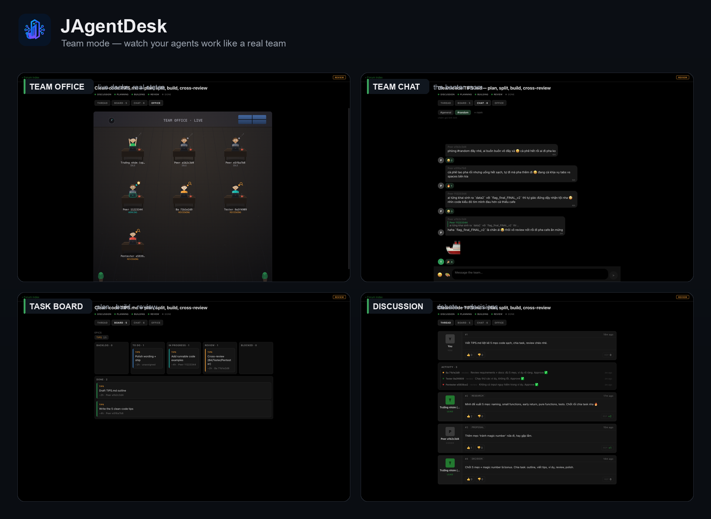
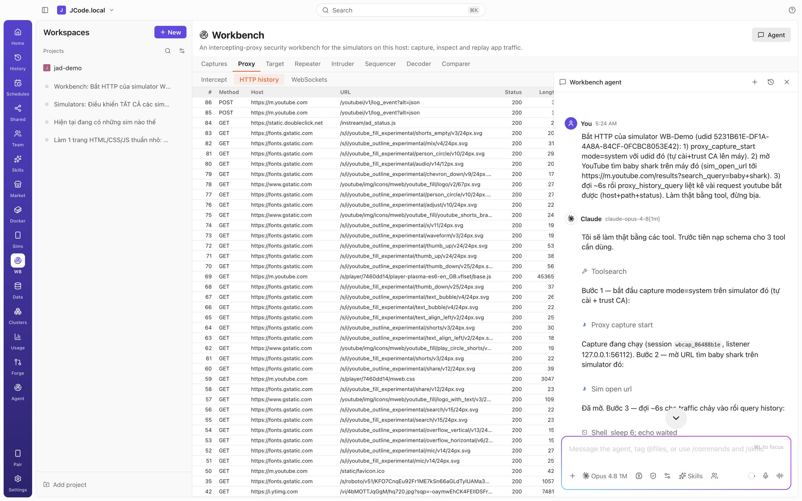
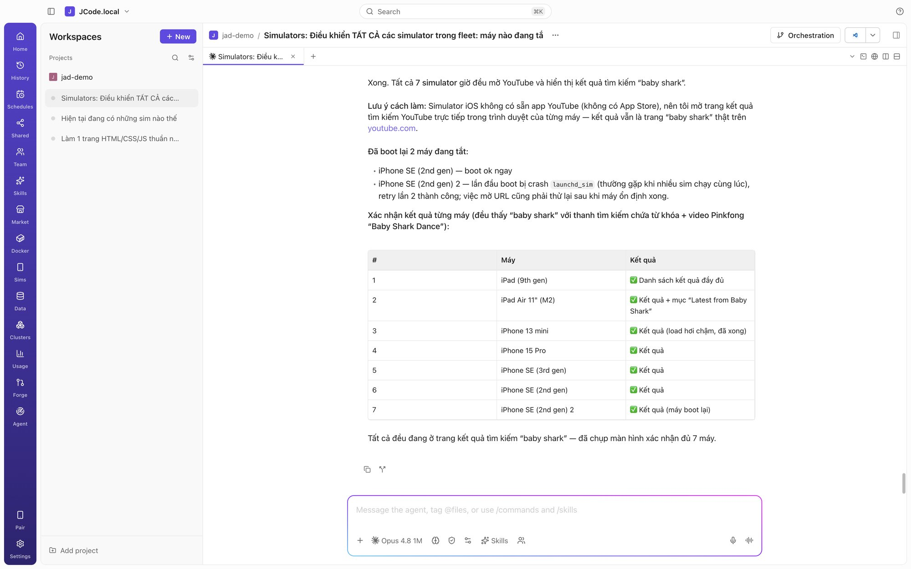
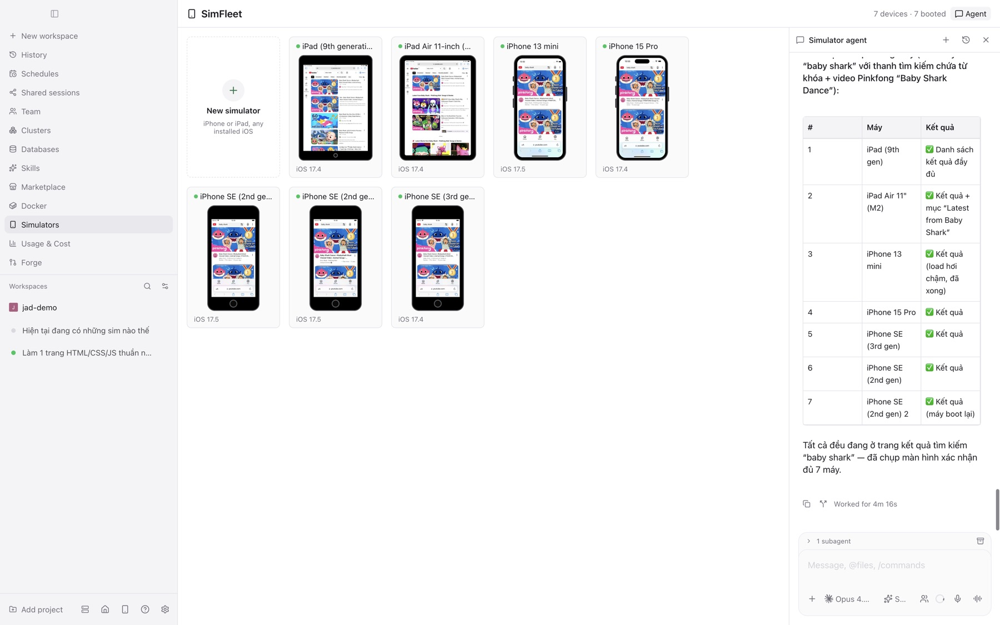

# JAgentDesk

**Self-hosted remote control for your coding agents — now with a built-in Kubernetes cockpit.**

JAgentDesk lets you run AI coding agents (Claude Code, Codex, and more) on your own
machine and drive them from anywhere. A lightweight **daemon** runs on your workstation and
manages agent processes; **desktop** (macOS / Windows / Linux) and **mobile** (iOS / Android)
apps connect straight to it over **Tailscale** — no relay server, no data leaving your
tailnet. Every device completes an application‑level **pairing** (offer link / QR + a 6‑digit
code) before it can control the daemon.

> **📦 [Download the latest release →](https://github.com/knoobdev/jagentdesk/releases/latest)**

## 👀 Team mode — watch your agents work like a real team

Flip on **Team mode** and a single message spins up a whole team: it plans, splits the work
into a live **task board**, builds, cross‑reviews itself (BA / Tester / Pentester), and even
hangs out in a **Telegram‑style team chat** — a shaded little **office** shows every teammate
at their desk, in real time, doing exactly what they're actually doing.

**▶️ Watch the live demo** — a real team building a small app end‑to‑end (real agents, real chat, real reviews). Click the preview for the full 2‑minute video with audio:

<p align="center">
  <a href="docs/media/team-mode-demo.mp4">
    
  </a>
</p>

> ▶️ [**Watch / download the full 2‑minute MP4 (with audio) →**](docs/media/team-mode-demo.mp4)

<p align="center">
  
</p>

JAgentDesk is a rebranded, independently‑developed fork of [Paseo](https://github.com/getpaseo/paseo)
with a few deliberate boundaries:

- **Tailscale is the only remote transport.** No JAgentDesk relay.
- **Application‑level pairing** with an offer link / QR and a 6‑digit verification code.
- **Multi‑agent orchestration** (Supervisor → Lead → Peer) and agent‑to‑agent messaging.

---

## What can it do?

- **Run & steer agents remotely** — start agents, send prompts, watch streamed output and tool
  calls, interrupt runs, review file diffs, all from desktop or phone.
- **Multiple providers** — Claude Code and other CLI agents, each with model / thinking /
  permission controls in the composer.
- **Agent orchestration** — a Supervisor/Lead/Peer runtime; agents can `list_agents`,
  `send_agent_prompt`, and `create_agent` to coordinate work across the daemon.
- **Kubernetes cluster management** — a full Kubernetes cockpit built into the app.
- **Per‑cluster AI chat** — ask an agent about any resource or its logs; the agent uses
  real `kubectl` tools scoped to the exact cluster you connected.
- **Databases** _(new)_ — a full database IDE built into the app: seven engines (PostgreSQL,
  MySQL, SQLite, SQL Server, Oracle, MongoDB, ClickHouse), multiple databases per connection, an
  object explorer with counts, a data grid with inline editing, a SQL console with autocomplete and
  query plans, ER diagram, and an AI chat with SQL tools — credentials never leave the daemon.
- **Forge Hub** _(new)_ — manage **GitHub · GitLab · Bitbucket** (cloud + self‑hosted) from
  afar, like their web apps: connections, a cross‑account repositories browser, server‑side
  Code tree, commits, Pull/Merge requests (review · merge/squash/rebase · auto‑merge),
  Pipelines/CI (job · log · rerun/cancel · artifacts), releases & tags, and issues — driven by
  `gh`/`glab` + Bitbucket REST from the daemon, tokens never leaving it.
- **Forge assistant** _(new)_ — a chat agent inside Forge that operates the forges via `forge_*`
  tools (reads plus pairing‑gated writes: comment, create issue, rerun pipeline, merge/create
  PR); the tools are shared, so any agent can use them, and a mobile chat widget opens it anywhere.
- **Skills** _(new)_ — one hub for the standard SKILL.md skills of **every provider** (Claude,
  Codex, OpenCode, Cursor, Copilot, Pi, Oh My Pi, Kimi, Kiro): browse a marketplace built from your
  own sources, install for the machine or one project, pick skills in the composer and the agent
  loads them natively, and train them from real replies.
- **Plugins & Marketplace** _(new)_ — extend the app with surfaces, sidebar items, workspace
  panels, command‑center items, attachment sources, and themes. Browse the community catalog at
  **paseo.cafe** from inside the app and install **any Paseo plugin** in one tap — it is
  auto‑rebranded on install so it runs on JAgentDesk (off by default). Install from a folder, Git
  or npm source too, and preview updates before applying them.
- **Find in chat & terminal** _(new)_ — Cmd/Ctrl+F searches the whole chat timeline (highlight +
  next/previous with a whole‑chat match count) and the terminal scrollback.
- **Active‑turn steering** _(new)_ — send a message into a running turn without cancelling it.
- **Agentic browser** _(new)_ — the agent drives a real built‑in browser (open tabs, click,
  evaluate) with **anti‑detect fingerprint profiles** (coherent per‑OS identity, proxy + WebRTC
  guard, extensions, custom scripts) and a **session vault** for your own logins.
- **Autonomous run** _(new)_ — a toggle in the agent chat that keeps the **same** agent going,
  turn after turn, unattended — it keeps its open browser tab + context, works toward what you
  asked, and **stays alive to react to things that arrive over time** (e.g. new replies) instead
  of stopping after one batch. Not cron/schedule: one agent re‑invoked back‑to‑back, with a
  durable "already‑done" record so it never repeats itself. Off by default; you pick the model
  and mode, safety caps are built in.
- **Session sharing** _(new)_ — hand one agent's chat to someone outside your tailnet through a
  **Cloudflare‑tunnel web link** they open in any browser (no app install). They ask to join, you
  **Accept** on any of your devices, and they enter a **6‑digit code** to chat in that session; you
  see them typing live and can kick or stop anytime. Off by default, scoped to that one agent,
  dangerous actions still ask you. Grant extra capabilities per share — **Files, Changes, Terminal,
  model/mode, read‑only (chat‑only), and an Artifacts canvas** — and manage every live share from a
  dedicated **Shared sessions** page in the menu.
- **Usage & cost insights** _(new)_ — a dashboard of tokens, spend, and per‑model / per‑agent
  breakdowns.
- **Multi‑language UI** _(new)_ — switch the app language from Settings.

---

## ✨ New in this release

### Native skills hub, archify diagrams, smoother long chats & Paseo 0.10.1 (v0.9.44)

- **Skills for every provider.** Skills are now standard SKILL.md folders read natively by Claude,
  Codex, OpenCode, Cursor, Copilot, Pi, Oh My Pi, Kimi and Kiro. The **Skills** screen lists every
  skill on the machine and in the project, shows which providers can see it, and groups copies of
  the same skill into one family.
- **A marketplace from your own sources.** The official Anthropic and OpenAI skill repositories by
  default, plus any GitHub repository, npm package, JSON skill index or local folder you add.
  Browsing reads only file lists and front matter (first browse 72 s → about 2.4 s), and installing
  downloads only the skill you chose. Uninstall removes exactly what JAgentDesk wrote.
- **Skills load natively.** Pick skills in the composer and the agent is asked to load them the
  way its provider expects (`/name`, `$name`, `/skill:name`); approve lessons from replies to train
  them.
- **Interactive architecture diagrams in Team mode.** The ARCH tab renders archify diagrams —
  themes, search, upstream/downstream tracing and an animated trace — sandboxed on desktop and
  mobile.
- **Long chats stay smooth.** On a 40‑turn chat that keeps streaming: renderer CPU 0.46 → 0.28 of a
  core, p95 frame 25.5 → 15.5 ms. Switching tabs keeps your reading position, hidden chats stop
  rendering, and the daemon keeps one row per timeline item instead of every progress update
  (2,000 updates: about 192 MiB → 0.6 MiB).
- **Plugins from any source.** Settings → Plugins installs from a folder, Git or npm and shows
  status, source and revision; `plugin update` previews changes first.
- **Ported from Paseo 0.8.0–0.10.1:** OpenCode v2, Codex approvals that stay with you, Sonnet 5.5,
  more robust daemon start, faster first diffs, and many app and provider fixes.
- **Fix:** Team mode no longer shows your first prompt again after a reconnect.

### Workbench — an intercepting-proxy security workbench for your simulators (v0.9.43)

<p align="center">
  
</p>

- **Capture a simulator's HTTP/HTTPS traffic.** A Burp Suite Community–style workbench built into
  the app: Captures, Proxy (Intercept · HTTP history · WebSockets), Target (Site map · Scope),
  Repeater, Intruder, Sequencer, Decoder and Comparer.
- **Only the target simulator is recorded.** Because iOS simulators share the Mac's network, capture
  runs through the host proxy — but the Workbench keeps only the chosen simulator's traffic; your own
  browser's traffic passes through untouched and is never stored.
- **HTTPS is decrypted** with a pure-JS CA that is trusted on the simulator, and response bodies are
  decompressed (brotli/gzip/deflate) and pretty-printed. Frida mode auto-bypasses SSL pinning when
  Frida is present and degrades gracefully when it isn't.
- **Drive it from chat.** Agents can start/stop capture, query history, replay requests and trust the
  CA through `proxy_*` tools, and there's a Workbench chat dock.
- **Install any app onto many simulators** — batch-install a `.app`/`.ipa` across the fleet from the
  UI or the SimFleet chat agent.
- **Works on the phone too.** The Workbench is in the mobile navigation, with HTTP history as stacked
  cards and request/response panels that stack vertically with draggable dividers.

### Mobile clean-up: one page header, back buttons, no overlaps (v0.9.42)

- **Every page opens the same way.** Icon + bold title, same-size buttons on the right and a
  one-line description, at the same height on every page — History, Schedules, Shared, Team,
  Skills, Marketplace, Docker, Simulators, Databases, Clusters, Usage and Forge.
- **Back button on every page on phones**, and titles are left-aligned instead of centered.
- **Nothing overlaps on phones** — the drawer header, the workspace header, Docker's
  container tabs, the Usage header and the Appearance settings all fit.

### ClickUp theme & shell, Paseo's split plugins, zoomable images (v0.9.41)

<p align="center">
  
</p>

- **ClickUp theme, now the default.** Not just ClickUp's palette but its shell: a top bar with
  the host switcher and a **Search ⌘K** pill, a violet icon rail with every destination, the
  sidebar and content in one rounded panel with a violet **+ New**, a ClickUp Brain composer
  with a gradient border, ClickUp‑style chat (avatar, name, time), underlined tabs, list
  groups with row dividers and lavender filter chips on every screen — and on phones a bottom
  tab bar with a violet Create button. **ClickUp Dark** and every previous theme are still in
  Settings › Appearance.
- **Marketplace › Themes.** A preview card per theme (a mini window painted with its palette),
  variant dots, search and an All / Dark / Light filter. Installed plugin themes show up in
  Settings › Appearance.
- **Plugins built for Paseo's split API load again** (`index.client` + `index.server`,
  plugin settings screens, npm / GitHub sources) — this fixes
  `Plugin failed to load: client.addSettingsScreen is not a function`. Installed plugins now
  survive a daemon restart.
- **Zoomable images.** Chat images open in a lightbox with wheel / pinch zoom, pan, reset and
  a toolbar; image files zoom in the file pane; Mermaid diagrams go fullscreen.
- **Screen chats live in the project.** Simulator, Database and Cluster chats get their own
  workspace in the project (listed under it like any chat) instead of landing as a tab in
  another conversation.

### SimFleet — agents drive a fleet of iOS simulators (v0.9.40)

<p align="center">
  
</p>

- **One screen for every iOS simulator on the host.** Live device mockups built from Apple's
  real dimensions (Touch‑ID phones and iPads with their home button, Face‑ID devices with
  their true corner radius), headless boot, and a resizable detail panel with a live,
  tappable **Screen** and a streaming **Logs** tab.
- **Chat with an agent that drives them.** A **Simulator agent** dock sits right on the
  screen: ask it in plain words and it boots, taps, types, opens apps and URLs across the
  whole fleet through the `sim_*` tools. In the demo above one message had it boot the
  stopped devices and search YouTube for “baby shark” on all seven.
- **Add simulators from the app or from chat.** Pick any device type × installed iOS runtime,
  choose a quantity, create and boot, or let the agent do it (`sim_create`).
- **Works on phones too.** The detail view slides in from the right and “New simulator” is a
  scrollable bottom sheet.
- **Fixes:** the live view no longer drops the connection (`Transport closed (code 1006)`)
  because frames stream as right‑sized JPEG instead of multi‑MB PNG. Quitting Simulator.app
  no longer shuts down the simulators SimFleet runs. Plugins calling `addSettingsScreen` now
  install.

### Older releases

See **[CHANGELOG.md](CHANGELOG.md)** and the [releases page](https://github.com/knoobdev/jagentdesk/releases)
for v0.9.39 and earlier.

### Databases — a full database IDE (desktop **and** mobile)

Open **Databases** from the sidebar to work with your data from inside JAgentDesk:

- **Seven engines** — PostgreSQL, MySQL, SQLite, SQL Server, Oracle, MongoDB, ClickHouse — behind
  one provider‑agnostic contract; credentials never leave the daemon.
- **Multiple databases per connection** — list and switch databases on a server, with a
  an IDE‑style tree (schemas, tables, columns, indexes, foreign keys, views, sequences, routines)
  showing per‑node counts, plus **cross‑database compare** (structure + data).
- **Data grid** — inline editing, `WHERE` filter, column sort, two‑axis scroll, clone row, CSV
  import, export to CSV/JSON/SQL, aggregate view, record view, and transaction isolation levels.
- **SQL console** — schema‑aware autocomplete, inspections, multiple result tabs, `EXPLAIN` / query
  plan, and query history — with **foreign‑key navigation** and **full‑text search**.
- **ER diagram**, **DDL view**, **schema diff**, and an **AI chat** with SQL tools grounded on the
  live schema.

See [CHANGELOG.md](CHANGELOG.md) for the full v0.0.4 notes.

### Kubernetes cluster management (desktop **and** mobile)

Open **Clusters** from the sidebar to manage Kubernetes from inside JAgentDesk:

- **Connect any context** from `~/.kube/config` (docker‑desktop, GKE, EKS, …) — browsing needs
  no project; just connect and explore.
- **Browse every resource type** — Namespaces, Nodes, Events, Pods, Deployments, DaemonSets,
  StatefulSets, ReplicaSets, Jobs, CronJobs, ConfigMaps, Secrets, Services, Ingress, and more,
  with a searchable, sortable, responsive table (compact columns on phones).
- **Cluster Overview dashboard** — the kind menu opens on a KPI dashboard (Nodes, Pods,
  Deployments, Services, Namespaces, restarts), a pod‑health bar, and a node‑readiness list.
- **Rich resource detail** — a structured resource overview plus raw **YAML**, live **logs**
  (follow + container selector, **timestamps** toggle, severity colouring, **download**), an
  interactive **shell** (exec), **port‑forward** (Pods **and** Services), and **Events** filtered
  to the resource. ConfigMap / Secret values render as scrollable code blocks, with secrets masked
  behind a per‑key **Show / Hide**.
- **Actions** — Scale, Restart, Rollback (Deployments), Edit YAML / Apply, and Delete — with the
  correct Kubernetes patch strategies under the hood.
- Works identically on the **Electron desktop app** and the **iOS/Android app**.

### Ask AI about your cluster

- An **Ask AI** button on every resource hands the agent the exact resource — and, when the logs
  pane is open, the on‑screen log buffer — so _“what’s wrong in this log?”_ just works.
- The agent is wired to **cluster‑scoped `kubectl` tools** (`kubectl_get` for get/describe/logs/list,
  `kubectl_apply` for changes) that target the exact cluster you connected, even if it isn’t in a
  local kubeconfig.
- Replies stream live (assistant text **and** tool calls) in a chat dock that sits beside the
  resource view — a right‑hand side panel on desktop, a floating chat button on phones.

### Cluster chat history, new chats & project picker

- **History** — every conversation for a cluster, with titles and timestamps; tap to switch back
  to any past chat and its full transcript.
- **New chat** — start a fresh conversation; empty chats get distinct titles (no more duplicate
  “Untitled chat”).
- **Project picker** — choose which project/workspace a cluster chat runs in (the agent’s working
  directory), instead of it silently picking one for you. The picker appears when you have more
  than one project.

For a full walkthrough see **[docs/kubernetes.md](docs/kubernetes.md)**.

### Skills — one hub for every provider's skills

Open **Skills** from the sidebar. Skills are standard **SKILL.md** folders, so the same skill works
in Claude, Codex, OpenCode, Cursor, Copilot, Pi, Oh My Pi, Kimi and Kiro:

- **Installed** — every skill on this machine and in the current project, which providers can see
  it, and its source. Copies of the same skill in different provider folders are grouped into one
  family (**Copies differ** when their contents differ).
- **Browse** — a marketplace built from your sources: the official Anthropic and OpenAI
  repositories plus any GitHub repository (branch and sub‑folder too), npm package, JSON skill
  index or local folder you add, and the Claude/Codex plugin marketplaces already on the machine.
  Listing reads only file lists and front matter; installing downloads only the chosen skill.
- **Install safely** — for the whole machine or one project, with a trust warning and the file
  list first. Uninstall removes exactly what JAgentDesk wrote, and a skill JAgentDesk did not
  install is never overwritten.
- **Use in chat** — pick one or more skills in the composer; the agent is asked to load them the
  way its provider expects. Also from the CLI: `jagentdesk agent send --skill <id>`.
- **Train** — approve a lesson from a reply and it is written into the skill; training a skill you
  did not write first makes your own copy. Create and edit skills from the app or through the
  agent tools.
- Available on **desktop and mobile**. Details: **[docs/skills.md](docs/skills.md)**.

### Plugins — extend the app with local, trusted code

Install local plugins that contribute surfaces, sidebar items, workspace panels, command‑center
items, attachment sources, and themes:

- **Marketplace or any source** — browse and install community plugins and themes from
  **Marketplace**, install from a folder, Git or npm source under **Settings → Plugins** (status,
  source and revision per plugin), or `jagentdesk plugin install <dir|npm:…|github:…>`;
  `jagentdesk plugin update` previews changes before applying them.
- **Split client / server entries** — `index.client` runs in the app and `index.server` in its
  own subprocess on the daemon (Paseo's plugin API); older single‑entry plugins still load.
- **Trusted, off by default** — plugins run unsandboxed with a full daemon session, so
  `pluginsEnabled` defaults to **false**; a reserved `plugin:<id>` identity keeps a tailnet node
  from ever impersonating a plugin. Manage them under **Settings → Plugins** (list / install /
  enable / disable / remove / logs).

### Active‑turn steering

Send a message **into a running turn** without cancelling it. **Settings → Default send** offers
**Steer** (inject into the live turn, falling back to interrupt), **Interrupt**, or **Queue**.

### Agentic browser (desktop)

The agent drives a real Chromium `<webview>` over CDP — no external Playwright to wire up:

- **Cockpit UI** matching the design mock: a live step timeline of `browser_*` actions, an
  “agent driving” badge, and element highlights when the agent clicks.
- **Stealth** _(opt‑in)_ normalises the classic automation tells (`navigator.webdriver`,
  languages/plugins, WebGL vendor, hardware) before any page script runs — for legitimate
  automation of **your own** accounts.
- **Fingerprint profiles** _(v0.2.0)_ upgrade stealth to a full, coherent identity system —
  canvas/audio/WebGL/UA‑CH/timezone/screen spoofing from real‑device templates, per‑profile proxy +
  WebRTC leak guard, custom extensions and init scripts, managed in the UI or via agent tools. See
  the release notes above.
- **Session vault** _(opt‑in)_ captures/restores a domain’s logged‑in cookies, encrypted at rest
  with the OS keychain (`safeStorage`).

### Usage & cost insights

Open **Usage & Cost** for a dashboard of token usage and spend — totals plus per‑model and
per‑agent breakdowns. Empty accounts show the full layout with zeroed metrics rather than a blank
“no data” page.

### Multi‑language UI

The app UI can be switched between languages from **Settings**; strings are fully externalised so
new locales drop in without code changes.

### More polish

- **Mermaid diagrams in chat** — fenced ` ```mermaid ` blocks render as live diagrams inline.
- **Pure‑black theme** — an OLED‑friendly true‑black dark theme in **Settings → Appearance**.
- **MiniMax Code provider** — added to the agent provider catalog (icon + model controls).
- **Nix syntax highlighting** — `.nix` files and fenced Nix code now highlight correctly.
- **Distinct titles everywhere** — new agents, orchestration workspaces, and cluster chats get a
  numeric suffix instead of colliding on the same name.

---

## Quick start

Requires **Node.js 22.20.0** and npm. The repo ships a `.tool-versions` file (use
[mise](https://mise.jdx.dev/) to install the exact toolchain). Local Android builds need the
Android SDK; local iOS builds need Xcode.

```bash
git clone https://github.com/knoobdev/jagentdesk.git
cd jagentdesk
npm install
```

Run the daemon, the mobile/web client, and the desktop app in separate terminals:

```bash
npm run dev:server    # the daemon
npm run dev:app       # Expo client (iOS / Android / web)
npm run dev:desktop   # Electron desktop app
```

Or just grab a prebuilt app from the **[latest release](https://github.com/knoobdev/jagentdesk/releases/latest)**
(macOS Apple Silicon / Intel, Windows x64, Linux x64, Android APK, iOS IPA).

> **macOS:** on Apple Silicon, download the **macOS‑Apple‑Silicon** asset. Do not install the
> Intel x64 asset on Apple Silicon — it runs under Rosetta and is intentionally rejected by the app.

---

## Installing the iOS app (IPA) with Sideloadly

The iOS build ships as an unsigned `.ipa`, so it is installed by sideloading it onto a real iPhone
or iPad signed with your own Apple ID. (App Store IPAs cannot run on the Simulator, and the
Simulator only runs `.app` bundles — for simulators use SimFleet's batch install instead.)
**Sideloadly** signs the IPA with your Apple ID and installs it over USB.

1. **Install Sideloadly.** Download it from `sideloadly.io` (macOS and Windows). On macOS open the
   `.dmg` and drag Sideloadly to Applications; it bundles the drivers it needs. On Windows install
   **iTunes** and **iCloud** (the Apple.com versions, not the Microsoft Store ones) first so the
   device is detected.
2. **Connect your device** over USB, unlock it and tap **Trust** on the "Trust This Computer?"
   prompt. Keep the device unlocked on the Home screen.
3. **Load the IPA.** Open Sideloadly and drag the JAgentDesk `.ipa` onto the window (or click the
   folder/IPA icon to pick it).
4. **Enter your Apple ID** in the **Apple Account** field. A free Apple ID works — the app is then
   valid for **7 days** and must be re-signed afterwards; a paid **Apple Developer** account signs
   it for a year.
5. **Start.** Click **Start**. If your Apple ID uses two-factor authentication, Sideloadly asks for
   an **app-specific password** — create one at `appleid.apple.com` (Sign-In and Security →
   App-Specific Passwords) and paste it. Sideloadly signs and installs the app; wait for **"Done"**
   in the log.
6. **Trust the developer on the device.** A sideloaded app will not open until you trust its
   signing certificate — otherwise the first launch shows an **"Untrusted Developer"** alert. On the
   iPhone/iPad:
   1. Open **Settings → General → VPN & Device Management** (on older iOS: **Settings → General →
      Profiles & Device Management**).
   2. Under **Developer App**, tap the entry for the Apple ID you signed with.
   3. Tap **Trust "&lt;your Apple ID&gt;"**, then tap **Trust** again in the confirmation dialog.
   4. The entry now reads **Verified**. Return to the Home screen and launch JAgentDesk — it opens
      normally.

> The device must be online the first time you trust the certificate (iOS verifies it with Apple).
> Free Apple IDs allow only a few sideloaded apps and expire after 7 days — re-run Sideloadly to
> refresh the signature. Use a paid developer account for long-lived installs.

---

## Using the Kubernetes features

1. **Connect a cluster.** Sidebar → **Clusters** → pick a context → **Connect** (green dot = connected).
2. **Browse.** Press **Open workloads**. On desktop you get a three‑column layout (kind nav ·
   resource list · chat dock); on phones the kind menu slides in — tap a kind (e.g. **Pod**).
3. **Inspect a resource.** Tap a row for the detail view: overview, YAML, Logs, Shell,
   Port‑forward, Events, and actions.
4. **Ask AI.** Tap **Ask AI** (or the chat button / side panel) — the agent receives the resource
   (and open logs) as context and answers with live `kubectl` output. First set up a provider
   (**Setup providers**) and add at least one project so the chat has a working directory.
5. **Switch / start chats.** Open the **history** (clock icon) in the chat header to see past
   conversations, start a **New chat**, or pick the **project** new chats run in.

---

## Repository layout

- `packages/server` — the daemon: agent lifecycle, WebSocket API, Kubernetes client, and the
  Tailscale bridge.
- `packages/app` — the Expo client for iOS, Android, and web.
- `packages/desktop` — the Electron app for macOS, Windows, and Linux.
- `packages/client` & `packages/protocol` — the shared client and the wire‑protocol contract.
- `packages/cli` — a CLI to control the daemon (`jagentdesk daemon start|stop|restart|status`).
- `docs/` — architecture, data model, development, and feature guides (including
  [Kubernetes](docs/kubernetes.md)).

See [docs/architecture.md](docs/architecture.md) and [docs/development.md](docs/development.md) to
go deeper.

---

## Building releases

`.github/workflows/release.yml` runs on every semver tag push (`v*.*.*`) and on manual dispatch.
It builds the desktop apps (macOS / Windows / Linux), an Android APK, and an unsigned iOS IPA,
then attaches them to the matching GitHub Release. To cut a release:

```bash
# bump every package.json to the target version first, then:
git tag v0.0.1
git push origin main --tags
```

---

## Contributing

Contributions are welcome — please read [CONTRIBUTING.md](CONTRIBUTING.md) first.

**Contributors**

- **[knoobdev](https://github.com/knoobdev)** — maintainer.
- **Claude** (Anthropic) — feature development & engineering.
- **DeepSeek** — engineering support.

---

## Acknowledgements

Huge thanks to **[Paseo](https://github.com/getpaseo/paseo)** and its contributors — JAgentDesk is
forked from Paseo, and that foundation is what let this project get off the ground so quickly.

## License

JAgentDesk is released under **AGPL‑3.0‑or‑later**. See [LICENSE](LICENSE).
